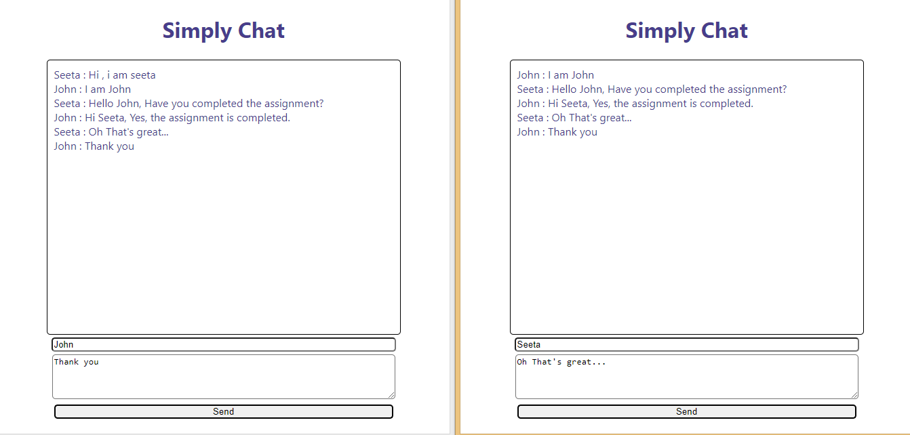

## Simple Chat

## About

A Simple Realtime Chat App using Websockets

## Tech Stack

- Socket.io for Websockets
- HTML, Javascript, Nodejs, Expressjs - for Backend and Frontend

## How to run this application
- Clone the repo using `git clone` command given at the top right corner
- Enter the below commands in the terminal:
```
npm install 
node index.js
```
- View the webapp at http://localhost:3000

## Sample Screenshot




## Todo (in future)

- Beautify the design using CSS

----


# Thanks for visiting